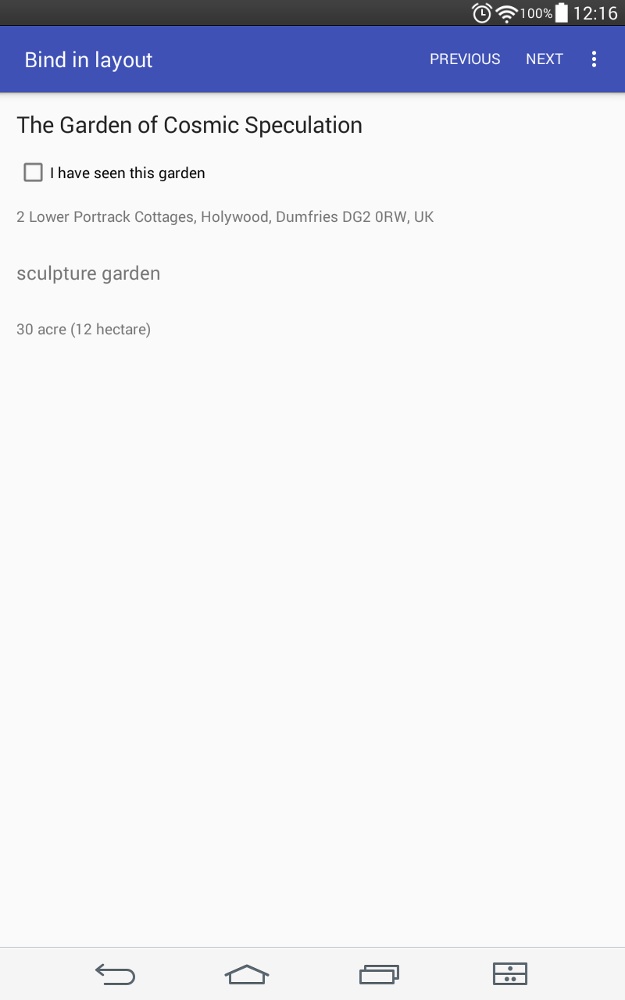
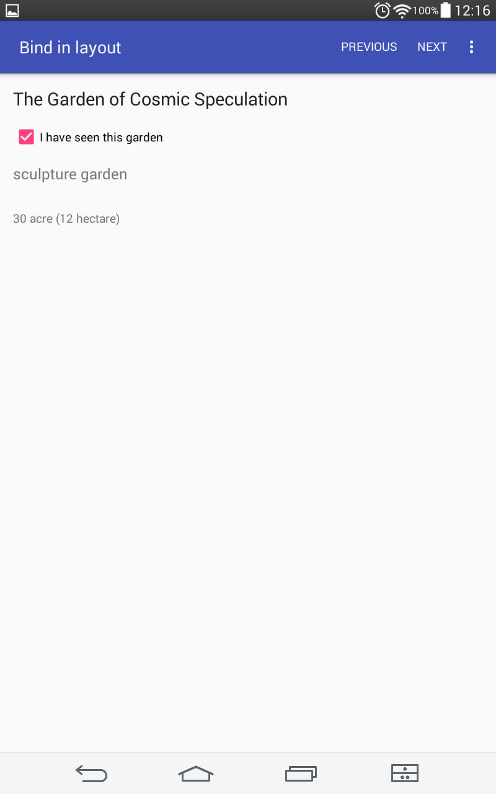

# using Data Binding


Very simple app to demonstrate power of Data Binding library.

No more findViewById :)


In this app there are three objects of class GardenInfo.

You can change which garden you see by clicking 'next' or 'previous' item in menu bar of the activity.

Most interesting activity is BindInLayoutActivity. All you need to do to change garden that is shown - you need to pass relevant object to the ActivityBindInLayoutBinding. 

```

	mBinding.setGarden(gardens.get(chosenGarden));

```

And that's all! Simple as that.


All preparing in java consist of:

- Creating object of class ActivityBindInLayoutBinding

```

	mBinding = DataBindingUtil.setContentView(this, R.layout.activity_bind_in_layout);
	
```

- And adding listeners to this object

```

	mBinding.setGardenListener(new GardenListener());

```

To create such a class(ActivityBindInLayoutBinding):

- First. Enable data binding:

```

android {
    ...
    dataBinding {
        enabled = true
    }
}

```

- Second. In your layout(in this case 'activity_bind_in_layout') put all layout xml code into <layout> tag

- Build

To enable variables

- Create variables to hold data and listener

```

<layout ...>
    <data>
        <variable
            name="garden"
            type="com.miymayster.coursetrail_databinding.GardenInfo" />
        <variable
            name="gardenListener"
            type="com.miymayster.coursetrail_databinding.GardenListener" />
    </data>

```

- Link to variables in layout everywhere you need them

```
	android:text="@{garden.name}"
	...
	android:onClick="@{gardenListener::methodReferenceOnClick}"
	...
	android:checked="@{garden.seen}"
	...
	android:onCheckedChanged="@{(cb, isChecked) -> gardenListener.seenChanged(garden, isChecked)}"
	...
	<include layout="@layout/address" bind:garden="@{garden}" />
	...
	android:onClick="@{(view) -> gardenListener.listenerBindingOnclick(view, garden)}"
	...
	android:visibility="@{garden.seen ? View.GONE : View.VISIBLE}"

```
 
Make in java your info class and fields Observable so that interface could react on their data changes







